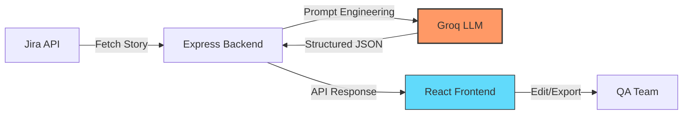

# 🤖 GenAI User Story to Test Case Generator
### Bridging the gap between Product Requirements and Quality Assurance with LLMs.

---

## 🌟 The Vision
Manual test case creation from Jira tickets is time-consuming and prone to human error. This application automates the transition from **User Story** to **Structured Test Suite** by leveraging High-Performance LLMs (Groq API). It ensures 100% acceptance criteria coverage in seconds.

## ✨ Key Features
* **🔗 Seamless JIRA Integration:** Fetch user stories, descriptions, and acceptance criteria directly via Jira API.
* **🧠 Intelligence Layer:** Powered by **Groq API** for ultra-fast, structured test case generation.
* **📋 Modern UI:** Built with React & Vite for a snappy, responsive consultant-grade experience.
* **🛡️ Type-Safe Backend:** Node.js/Express backend fortified with **Zod** for strict data validation.

---

## 📺 Video Demo

Watch a demo of the app in action:

[▶️ Click here to view the video demo](https://drive.google.com/file/d/1QKkJHwcKfqYSE9t3ndEKwghyfAPDPccf/view?usp=drive_link)
